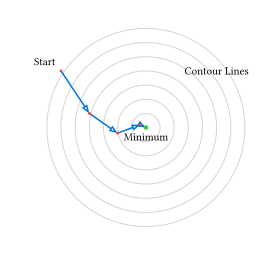

# 関数の最適化

物理学において、ある関数の最小値（または最大値）を求める**最適化 (Optimization)** は極めて重要なテーマです。

- **ポテンシャルエネルギーの最小化**: 系はエネルギーが低い安定な状態に向かいます。
- **モデルフィッティング**: 実験データと理論モデルの誤差（最小二乗法など）を最小にするパラメータを探します。
- **作用最小の原理**: 古典力学の運動は作用積分を最小にする経路をとります。

関数の最小値を与える点では微分（勾配）が $0$ になるため、最適化は「導関数 $= 0$ となる解を見つける」という点で求根問題と密接に関連しています。

## 勾配降下法 (Gradient Descent)

最も基本的かつ直感的な手法が**勾配降下法**です。
「今の場所で一番急な下り坂の方向へ少し進む」ことを繰り返して、谷底（極小値）を目指します。

### アルゴリズム

多変数関数 $f(vb(x))$ の勾配 $grad f(vb(x))$ は、関数が最も増加する方向を向いています。したがって、その逆方向 $-grad f(vb(x))$ へ進めば値を小さくできます。

$$ vb(x)_(n+1) = vb(x)_n - alpha grad f(vb(x)_n) $$

ここで $alpha$ は**学習率 (Learning Rate)** と呼ばれる正のパラメータで、一歩の大きさを調整します。



### Rustによる実装

関数 $f(x, y) = x^2 + y^2$ （お椀型の関数）の最小値 $(0, 0)$ を求めてみましょう。

$$ grad f = (pdv(f, x), pdv(f, y)) = (2x, 2y) $$

```rust
fn main() {
    // 目的関数とその勾配
    let f = |x: &[f64]| x[0].powi(2) + x[1].powi(2);
    let grad = |x: &[f64]| vec![2.0 * x[0], 2.0 * x[1]];

    let mut x = vec![2.0, 1.0]; // 初期値
    let alpha = 0.1;            // 学習率
    let max_iter = 100;

    for i in 0..max_iter {
        let current_val = f(&x);
        let g = grad(&x);
        
        // 勾配の大きさが十分小さくなったら終了
        let g_norm: f64 = g.iter().map(|v| v.powi(2)).sum::<f64>().sqrt();
        if g_norm < 1e-6 {
            println!("収束しました: x={:?}, f(x)={:.6} (反復: {})", x, current_val, i);
            return;
        }

        // 更新 x = x - alpha * grad
        for j in 0..2 {
            x[j] -= alpha * g[j];
        }
        
        println!("iter {}: x={:?}, f(x)={:.6}", i, x, current_val);
    }
}
```

### 学習率の重要性

- $alpha$ が**小さすぎる**と、収束までに非常に時間がかかります。
- $alpha$ が**大きすぎる**と、谷底を飛び越えてしまい、振動したり発散したりします。

## 局所解と大域解

勾配降下法やニュートン法などの反復法には、「初期値の近くにある谷底（**局所的最適解：Local Minima**）」には辿り着けますが、本当の最小値（**大域的最適解：Global Minima**）が見つかるとは限らないという弱点があります。

複雑な地形（多峰性関数）で大域解を見つけるには、より高度な手法（焼きなまし法、遺伝的アルゴリズム、あるいは初期値を多数変えて試すなど）が必要になります。

## その他の手法

勾配降下法は単純ですが、収束が遅い場合があります（特に谷が細長い場合）。より効率的な手法として以下のようなものがあります。

- **ニュートン法（最適化）**: 2階微分（ヘッセ行列）の情報を使って、放物面近似を行いながら進む。収束は速いが計算コストが高い。
- **共役勾配法 (Conjugate Gradient)**: 前回の探索方向を考慮して、効率的に進む。大規模な問題に向く。
- **準ニュートン法 (Quasi-Newton, e.g., BFGS)**: ヘッセ行列を直接計算せず、勾配の履歴から近似する。実用上最もよく使われる強力な手法の一つ。

Rustには [`argmin`](https://crates.io/crates/argmin) のような最適化ライブラリがあり、これらの高度なアルゴリズムを簡単に利用できます。

---

第5章はこれで終わりです。次は[第6章: フーリエ変換](../ch06-fourier/README.md)に進みましょう。
