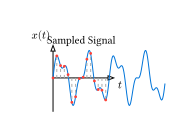

# 離散フーリエ変換の基礎

コンピュータで扱うデータは、一定の時間間隔でサンプリングされた離散的な数値の列です。このような離散データに対してフーリエ変換を行う手法を**離散フーリエ変換 (Discrete Fourier Transform, DFT)** と呼びます。



## DFTの定義

長さ $N$ の複素数データ系列 $x_0, x_1, ..., x_(N-1)$ に対して、その離散フーリエ変換 $X_0, X_1, ..., X_(N-1)$ は次のように定義されます。

$$ X_k = sum_(n=0)^(N-1) x_n exp(- i (2 pi k n) / N) quad (k = 0, 1, ..., N-1) $$

ここで $i$ は虚数単位です。$X_k$ は、元の信号に含まれる周波数成分（振幅と位相）を表します。

逆に、$X_k$ から元の信号 $x_n$ を復元する**逆離散フーリエ変換 (IDFT)** は以下の通りです。

$$ x_n = 1/N sum_(k=0)^(N-1) X_k exp(i (2 pi k n) / N) quad (n = 0, 1, ..., N-1) $$

## DFTの直接計算 (Rust)

定義式に基づいて、DFTを直接計算するコードを実装してみましょう。Rustの `num-complex` クレートを使用して複素数を扱います。

```toml
[dependencies]
num-complex = "0.4"
```

```rust
use num_complex::Complex;
use std::f64::consts::PI;

fn dft(x: &[Complex<f64>]) -> Vec<Complex<f64>> {
    let n = x.len();
    let mut x_k = Vec::with_capacity(n);

    for k in 0..n {
        let mut sum = Complex::new(0.0, 0.0);
        for n_idx in 0..n {
            let angle = -2.0 * PI * (k as f64) * (n_idx as f64) / (n as f64);
            let exponent = Complex::new(0.0, angle).exp();
            sum += x[n_idx] * exponent;
        }
        x_k.push(sum);
    }
    x_k
}

fn main() {
    // 例：4点のデータ
    let data = vec![
        Complex::new(1.0, 0.0),
        Complex::new(2.0, 0.0),
        Complex::new(3.0, 0.0),
        Complex::new(4.0, 0.0),
    ];

    let result = dft(&data);

    for (k, val) in result.iter().enumerate() {
        println!("X[{}] = {:.3} + {:.3}i", k, val.re, val.im);
    }
}
```

## 計算量と課題

上記のコードでは、外側のループ（$k$）と内側のループ（$n$）の2重ループになっているため、計算量は $O(N^2)$ となります。

データ数 $N$ が大きくなると計算時間が爆発的に増加します。

- $N=10^3$ のとき、$N^2 = 10^6$ 回の計算。
- $N=10^6$ のとき、$N^2 = 10^(12)$ 回の計算（非常に時間がかかる）。

この計算量を劇的に減らす手法が、次節で学ぶ**高速フーリエ変換 (FFT)** です。

---

[次節](./fft.md)では、計算効率を改善するFFTのアルゴリズムについて学びます。
