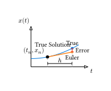

# オイラー法

**オイラー法 (Euler's Method)** は、常微分方程式の数値解法の中で最も基本的かつ単純な手法です。実用的な精度は低いものの、シミュレーションの基礎的な概念を理解するために不可欠です。

## アルゴリズム

1階の常微分方程式の初期値問題を考えます。

$$ dv(x, t) = f(t, x), quad x(t_0) = x_0 $$

微分の定義により、時間刻み幅 $h = Delta t$ が十分に小さければ、導関数は差分で近似できます。

$$ (x(t + h) - x(t)) / h approx f(t, x(t)) $$

これを $x(t+h)$ について解くと、以下の更新式（漸化式）が得られます。

$$ x_(n+1) = x_n + h f(t_n, x_n) $$

$$ t_(n+1) = t_n + h $$



幾何学的には、「現在の点 $(t_n, x_n)$ における接線の傾き $f(t_n, x_n)$ に沿って、時間 $h$ だけ進む」ことを意味します。

## Rustによる実装

例として、以下の方程式を解いてみましょう。
$$ dv(x, t) = -x, quad x(0) = 1 $$

これの解析解は $x(t) = e^(-t)$ です。

```rust
fn main() {
    // 微分方程式 dx/dt = f(t, x)
    let f = |_t: f64, x: f64| -x;

    let mut t = 0.0;
    let mut x = 1.0;
    let dt = 0.1; // 刻み幅
    let t_max = 2.0;

    println!("t, x(Numerical), x(Exact), Error");

    while t <= t_max {
        let exact = (-t).exp();
        let error = (x - exact).abs();
        println!("{:.2}, {:.6}, {:.6}, {:.2e}", t, x, exact, error);

        // オイラー法による更新
        x = x + dt * f(t, x);
        t = t + dt;
    }
}
```

実行結果（抜粋）：

```text
t, x(Numerical), x(Exact), Error
0.00, 1.000000, 1.000000, 0.00e0
0.10, 0.900000, 0.904837, 4.84e-3
0.20, 0.810000, 0.818731, 8.73e-3
...
```

## 誤差の性質

オイラー法の1ステップあたりの誤差（局所誤差）は $O(h^2)$ ですが、計算を進めるにつれて誤差が蓄積するため、全体の誤差（大域誤差）は **$O(h)$（1次精度）** になります。つまり、刻み幅 $h$ を半分にしても、誤差は半分にしかなりません。

高精度な計算が必要な場合、オイラー法では $h$ を極端に小さくする必要があり、計算時間がかかりすぎます。そこで次節の**ルンゲ＝クッタ法**が登場します。

## 2階微分方程式への適用

ニュートンの運動方程式 $F = ma$ のような2階微分方程式は、速度 $v = dv(x, t)$ を導入することで、連立1階微分方程式に書き換えて解くことができます。

$$ dv(x, t, 2) = F(x, v, t) / m $$

$$ arrow.r.double cases(
    dv(x, t) = v,
    dv(v, t) = F(x, v, t) / m
) $$

これをオイラー法で書くと：

$$ x_(n+1) = x_n + h v_n $$

$$ v_(n+1) = v_n + h F(x_n, v_n, t_n) / m $$

---

[次節](./runge-kutta.md)では、より高精度なルンゲ＝クッタ法について学びます。
