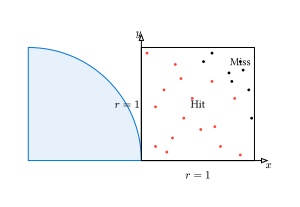

# モンテカルロ積分

乱数を用いて定積分の近似値を求める手法を**モンテカルロ積分**と呼びます。

## 基本的な考え方

領域 $V$ における関数 $f(vb(x))$ の積分を考えます。

$$ I = integral_V f(vb(x)) dd(vb(x)) $$

領域 $V$ 内から一様に $N$ 個の点 $vb(x)_1, vb(x)_2, ..., vb(x)_N$ をサンプリングしたとき、積分の近似値は以下の平均値で与えられます。

$$ I approx V/N sum_(i=1)^N f(vb(x)_i) $$

## 具体例：円周率 $pi$ の推定

最も有名な例は、単位正方形内の $1/4$ 円の面積を求めることで $pi$ を計算する手法です。

1. 領域 $[0, 1] times [0, 1]$ 内に一様に乱数のペア $(x, y)$ を打つ。
2. $x^2 + y^2 leq 1$ を満たせば「命中 (Hit)」、そうでなければ「外れ (Miss)」とする。
3. $pi approx 4 times (text("命中数")) / (text("全試行数"))$



### Rustによる実装

```rust
use rand::prelude::*;

fn main() {
    let n = 1_000_000;
    let mut hits = 0;
    let mut rng = thread_rng();

    for _ in 0..n {
        let x: f64 = rng.gen();
        let y: f64 = rng.gen();
        
        if x * x + y * y <= 1.0 {
            hits += 1;
        }
    }

    let pi_est = 4.0 * (hits as f64) / (n as f64);
    println!("Estimated pi = {:.6} (N = {})", pi_est, n);
}
```

## 一般の積分への適用（平均値法）

より一般的に、関数 $f(x)$ の $[a, b]$ における積分を求めます。

```rust
use rand::prelude::*;

fn main() {
    // 積分対象: f(x) = sin(x) in [0, PI]
    // 解析解は 2.0
    let f = |x: f64| x.sin();
    let a = 0.0;
    let b = std::f64::consts::PI;
    
    let n = 100_000;
    let mut sum = 0.0;
    let mut rng = thread_rng();
    
    for _ in 0..n {
        let x = rng.gen_range(a..b);
        sum += f(x);
    }
    
    let area = (b - a) * sum / (n as f64);
    println!("Integral result = {:.6}", area);
}
```

## 誤差の性質

モンテカルロ積分の誤差（標準偏差）は、試行回数 $N$ に対して $1 / sqrt(N)$ で減少します。
精度を10倍（1桁多く）にするには、計算量を **100倍** にしなければなりません。

これは1次元では効率が悪いですが、前述の通り多次元積分では非常に強力な武器になります。

---

[次節](./importance-sampling.md)では、サンプリング効率を向上させる「重点サンプリング」について学びます。
