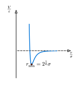

# 分子動力学シミュレーション

これまでの知識を総動員して、**分子動力学法 (Molecular Dynamics, MD)** のシミュレーションを構築しましょう。
MDは、原子や分子の動きをニュートンの運動方程式に従って計算し、物質の巨視的な性質（温度、圧力、相転移など）を微視的な視点から解析する強力な手法です。

## レナード・ジョーンズ・ポテンシャル

希ガス（アルゴンなど）の原子間相互作用としてよく用いられるのが、**レナード・ジョーンズ (Lennard-Jones, LJ) ポテンシャル**です。
粒子間距離を $r$ として、ポテンシャルエネルギー $V(r)$ は次のように表されます。

$ V(r) = 4 epsilon [ (sigma/r)^12 - (sigma/r)^6 ] $



ここで、$epsilon$ は相互作用の強さ（井戸の深さ）、$sigma$ は粒子の大きさ（衝突直径）に対応します。
右辺第1項（12乗）は近距離での強い反発力（パウリの排他律）、第2項（6乗）は遠距離での引力（ファンデルワールス力）を表します。

粒子 $i$ が粒子 $j$ から受ける力 $vb(F)_(i j)$ は、ポテンシャルの勾配の逆符号です。

$ vb(F)_(i j) = - nabla V(r_(i j)) = 24 epsilon / r_(i j)^2 [ 2(sigma/r_(i j))^12 - (sigma/r_(i j))^6 ] vb(r)_(i j) $

（ここで $vb(r)_(i j) = vb(r)_i - vb(r)_j$ です）

## ndarrayによるN体シミュレーションの実装

粒子数 $N$ の系を考えます。位置と速度はそれぞれ $N times 2$ の行列（2次元配列）として管理するのが効率的です。
[第2章](../ch02-basics/ndarray.md)で学んだ `Array2` を使用します。

### データ構造

```rust
use ndarray::{Array, Array1, Array2, Axis};
use ndarray_rand::RandomExt;
use ndarray_rand::rand_distr::Uniform;

struct MDSystem {
    n_particles: usize,
    box_size: f64,
    positions: Array2<f64>, // (N, 2)
    velocities: Array2<f64>, // (N, 2)
    forces: Array2<f64>,    // (N, 2)
}

impl MDSystem {
    fn new(n: usize, box_size: f64) -> Self {
        // ランダムな初期配置
        let positions = Array::random((n, 2), Uniform::new(0.0, box_size));
        // ランダムな初期速度（本来はマクスウェル分布に従わせる）
        let velocities = Array::random((n, 2), Uniform::new(-1.0, 1.0));
        let forces = Array2::zeros((n, 2));
        
        Self { n_particles: n, box_size, positions, velocities, forces }
    }
}
```

### 力の計算と周期的境界条件

MDでは通常、無限に広がる系を模倣するために**周期的境界条件 (Periodic Boundary Condition)** を採用します。
粒子が箱の右端から出たら、左端から戻ってくるように扱います。また、距離計算においても「最も近い像」との距離（Minimum Image Convention）を計算します。

```rust
impl MDSystem {
    fn compute_forces(&mut self) {
        // 力をリセット
        self.forces.fill(0.0);
        
        let epsilon = 1.0;
        let sigma = 1.0;
        
        // 粒子ペアごとのループ (i < j)
        for i in 0..self.n_particles {
            for j in (i + 1)..self.n_particles {
                // 相対ベクトル
                let mut dr = &self.positions.row(i) - &self.positions.row(j);
                
                // 周期的境界条件: 最近接イメージを探す
                // dr > L/2 なら dr <- dr - L
                // dr < -L/2 なら dr <- dr + L
                for k in 0..2 {
                    if dr[k] > self.box_size / 2.0 { dr[k] -= self.box_size; }
                    if dr[k] < -self.box_size / 2.0 { dr[k] += self.box_size; }
                }
                
                let r2 = dr.dot(&dr);
                
                // カットオフ（計算量削減のため遠方は無視することが多いが、ここでは省略）
                if r2 < 1e-6 { continue; } // 重なりすぎ回避
                
                let r2_inv = 1.0 / r2;
                let r6_inv = r2_inv * r2_inv * r2_inv;
                let r12_inv = r6_inv * r6_inv;
                
                // 力の大きさ（スカラー部分）
                let f_scalar = 24.0 * epsilon * r2_inv * (2.0 * r12_inv - r6_inv);
                
                // ベクトルとしての力 F_ij
                let f_vec = &dr * f_scalar;
                
                // 作用・反作用
                // self.forces.row_mut(i) += &f_vec; // ndarrayではこれが少し書きにくい
                
                // 要素ごとの加算
                self.forces[[i, 0]] += f_vec[0];
                self.forces[[i, 1]] += f_vec[1];
                self.forces[[j, 0]] -= f_vec[0];
                self.forces[[j, 1]] -= f_vec[1];
            }
        }
    }
}
```

### 時間発展（Velocity Verlet）

全体を一括して更新します。

```rust
impl MDSystem {
    fn step(&mut self, dt: f64) {
        // 1. 位置更新
        // x(t+dt) = x(t) + v(t)dt + 0.5*F(t)dt^2 (質量m=1とする)
        // ndarrayの演算を使って一括更新
        self.positions = &self.positions + &(&self.velocities * dt) + &(&self.forces * (0.5 * dt * dt));
        
        // 周期的境界条件の適用（箱の中に押し戻す）
        self.positions.mapv_inplace(|x| x.rem_euclid(self.box_size));

        // 現在の力を保存
        let old_forces = self.forces.clone();
        
        // 2. 新しい位置での力計算
        self.compute_forces();
        
        // 3. 速度更新
        // v(t+dt) = v(t) + 0.5*(F(t) + F(t+dt))dt
        self.velocities = &self.velocities + &(&(&old_forces + &self.forces) * (0.5 * dt));
    }
}
```

## おわりに

このプログラムを実行し、各ステップでの粒子の位置をファイルに出力すれば、アニメーションを作成することができます。
粒子数が増えると計算時間が $O(N^2)$ で増大するため、大規模な計算には近接リスト法などの工夫が必要になりますが、基本的な構造はこの通りです。

以上で、古典力学のシミュレーションの章を終わります。
シンプレクティック積分を用いることで、エネルギー保存則を破綻させることなく、惑星の軌道や多数の原子の動きを長時間追跡できることがわかりました。
