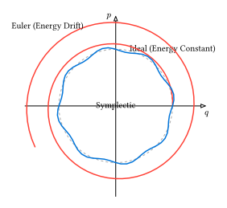

# シンプレクティック積分

[第7章](../ch07-ode/README.md)で学んだルンゲ＝クッタ法（RK4）は非常に高精度ですが、天体の軌道計算や分子動力学シミュレーションのように「エネルギー保存則が成り立つ系（ハミルトン系）」を長時間計算する場合、**エネルギーが徐々に保存されなくなる**という問題があります。

本節では、ハミルトン系の幾何学的構造（シンプレクティック構造）を保存するように設計された**シンプレクティック積分法**について学びます。

## エネルギー保存の破れ

単純な調和振動子（バネ定数 $k=1$, 質量 $m=1$）を考えます。ハミルトニアン（全エネルギー）は以下の通りです。

$ H = 1/2 v^2 + 1/2 x^2 $

これをオイラー法（前進差分）で解くと、エネルギーは時間とともに指数関数的に増大してしまいます。RK4を用いれば増大のペースは非常に遅くなりますが、それでも長期的にはエネルギー誤差が蓄積し、惑星の軌道であれば徐々に半径が変わってしまいます。



## オイラー・クローマー法

最も単純なシンプレクティック積分は、オイラー法をわずかに修正した**オイラー・クローマー法 (Euler-Cromer method)**（またはシンプレクティック・オイラー法）です。

**オイラー法（エネルギー保存しない）:**
$ x_(n+1) = x_n + v_n Delta t $
$ v_(n+1) = v_n + a(x_n) Delta t $

**オイラー・クローマー法（エネルギーが安定）:**
$ v_(n+1) = v_n + a(x_n) Delta t $ （先に速度を更新）
$ x_(n+1) = x_n + v_(n+1) Delta t $ （**更新後の速度**を使って位置を更新）

たったこれだけの変更ですが、この手法は位相空間上の面積（リウヴィルの定理）を保存する性質を持ち、エネルギーが振動するだけで発散しなくなります。

## 速度ベレ法 (Velocity Verlet)

オイラー・クローマー法は1次精度ですが、より高精度（2次精度）かつ分子動力学で標準的に使われるのが**速度ベレ法 (Velocity Verlet method)** です。

手順は以下の通りです。時間刻みを $Delta t$ とします。

1. 位置を半ステップ分進めるような形を含んで更新する：
   $ vb(x)_(n+1) = vb(x)_n + vb(v)_n Delta t + 1/2 vb(a)(vb(x)_n) (Delta t)^2 $
2. 新しい位置での力（加速度）を計算する：
   $ vb(a)_(n+1) = vb(F)(vb(x)_(n+1)) / m $
3. 速度を更新する（平均加速度を用いる形になる）：
   $ vb(v)_(n+1) = vb(v)_n + (vb(a)_n + vb(a)_(n+1))/2 Delta t $

この手法は時間反転対称性も持ち、非常に安定しています。

### Rustによる実装

速度ベレ法をRustで実装してみましょう。ここでは汎用性を持たせるため、位置と速度を保持する構造体を考えます。

```rust
struct Particle {
    x: f64,
    v: f64,
    inv_m: f64, // 1/mass
}

impl Particle {
    fn new(x: f64, v: f64, m: f64) -> Self {
        Self { x, v, inv_m: 1.0 / m }
    }
}

// 加速度を計算する関数（力場）
fn get_force(x: f64) -> f64 {
    -x // 調和振動子 F = -kx (k=1)
}

fn velocity_verlet_step(p: &mut Particle, dt: f64) {
    // Step 1: 位置の更新
    // x(t+dt) = x(t) + v(t)dt + 0.5 * a(t) * dt^2
    let a_current = get_force(p.x) * p.inv_m;
    p.x += p.v * dt + 0.5 * a_current * dt * dt;

    // Step 2: 新しい位置での加速度計算
    let a_next = get_force(p.x) * p.inv_m;

    // Step 3: 速度の更新
    // v(t+dt) = v(t) + 0.5 * (a(t) + a(t+dt)) * dt
    p.v += 0.5 * (a_current + a_next) * dt;
}

fn main() {
    let mut p = Particle::new(1.0, 0.0, 1.0);
    let dt = 0.1;

    for t_step in 0..100 {
        let time = t_step as f64 * dt;
        println!("t={:.1}, x={:.4}, v={:.4}, E={:.4}", 
            time, p.x, p.v, 0.5*p.v*p.v + 0.5*p.p*p.x); // エネルギー確認
        
        velocity_verlet_step(&mut p, dt);
    }
}
```

このコードを実行してエネルギー（$E = v^2/2 + x^2/2$）をプロットすると、RK4のように単調に減少/増加するのではなく、一定値の周りで微小に振動し続ける様子が確認できます。これがシンプレクティック積分の威力です。
