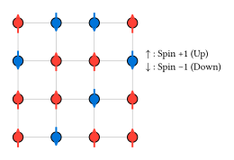

# イジング模型の基礎

統計力学において、**イジング模型 (Ising Model)** は最も単純かつ最も重要なモデルの一つです。
もともとは強磁性体（磁石）の性質を理解するために考案されましたが、現在では合金の規則化、気体-液体の相転移、さらにはニューラルネットワークのモデルとしても広く応用されています。

## モデルの定義

$N$ 個の格子点（スピン）があり、各スピン $s_i$ は $+1$（上向き）または $-1$（下向き）のいずれかの状態をとるとします。

系の全エネルギー（ハミルトニアン） $H$ は、隣り合うスピン間の相互作用 $J$ と、外部磁場 $h$ との相互作用によって以下のように定義されます。

$ H = - J sum_((i, j)) s_i s_j - h sum_i s_i $

ここで $sum_((i, j))$ は、隣接するスピンのペア（最近接格子点）に対する和を表します。

- **$J > 0$ (強磁性)**: 隣り合うスピンが同じ向き ($+ +$ または $- -$) になるとエネルギーが下がります（安定化）。これが「揃おうとする力」を生み出し、自発磁化の原因となります。
- **$J < 0$ (反強磁性)**: 隣り合うスピンが逆向きになろうとします。

## 統計力学の原理

温度 $T$ の熱平衡状態において、系がある特定のスピン配置 ${s}$ をとる確率は、**ボルツマン分布 (Boltzmann distribution)** に従います。

$ P({s}) = 1/Z e^(- beta H({s})) $

ここで $beta = 1 / (k_B T)$ は逆温度（$k_B$ はボルツマン定数）、$Z$ は確率の総和を1にするための規格化定数で、**分配関数 (Partition Function)** と呼ばれます。

$ Z = sum_({s}) e^(- beta H({s})) $

この $Z$ を計算できれば、内部エネルギーや比熱、磁化といったあらゆる熱力学量が求まります。
しかし、スピン数が $N$ のとき、可能な配置の総数は $2^N$ となり、少し大きな系（例：$10 times 10$ でも $2^100$ 通り）では計算不能な大きさになります。

そこで登場するのが、[第9章](../ch09-monte-carlo/README.md)で学んだ**マルコフ連鎖モンテカルロ法 (MCMC)** です。
すべての配置を足し合わせるのではなく、ボルツマン分布に従って「確からしい」配置をサンプリングすることで、物理量を近似的に計算します。
