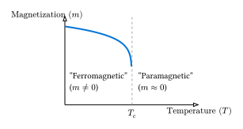

# 相転移とクリティカル現象

イジング模型の醍醐味は、単純なルールから**相転移 (Phase Transition)** という劇的な現象が現れることです。

## 強磁性相転移

温度を高温から下げていくと、ある臨界温度 $T_c$ を境に、それまでバラバラだったスピンの向きが揃い始め、巨視的な磁化（自発磁化）が発生します。

- **高温相 ($T > T_c$)**: 常磁性相。熱ゆらぎが支配的で、スピンはランダム。総磁化は平均してゼロ。
- **低温相 ($T < T_c$)**: 強磁性相。相互作用が支配的で、スピンが全体として揃う。総磁化は非ゼロ。

オンサーガーの厳密解により、2次元正方格子イジング模型の臨界温度（解析解）は以下のように知られています。

$ k_B T_c / J = 2 / ln(1 + sqrt(2)) approx 2.269 $

シミュレーションを行うと、この温度付近で様々な物理量が特異な振る舞いを示します。

## 物理量の測定

シミュレーションで測定すべき主な量は以下の通りです（$N$ は総スピン数）。

1. **単位スピンあたりの平均磁化** $m$:
   $ m = 1/N mean(abs(sum_i s_i)) $
   （有限系では全体が反転する可能性があるため、絶対値をとるのが一般的です）

2. **単位スピンあたりの比熱** $C$:
   エネルギーの揺らぎから計算できます（揺動散逸定理）。
   $ C = 1/N (mean(E^2) - mean(E)^2) / (k_B T^2) $

3. **帯磁率** $chi$:
   磁化の揺らぎから計算できます。
   $ chi = 1/N (mean(M^2) - mean(M)^2) / (k_B T) $

## シミュレーション結果の解釈

Rustプログラムで温度を変えながらこれらの量を測定すると、以下の結果が得られます。

- **磁化 $m$**: 低温では1に近く、温度上昇とともに減少し、$T_c$ 付近で急激にゼロに落ちます。
- **比熱 $C$**: $T_c$ 付近で鋭いピーク（発散）を持ちます。これは相転移に伴うエントロピーの急激な変化を表しています。

## 有限サイズ効果

厳密な相転移（特異点）は、無限大の系 ($N -> infinity$) でのみ起こります。
シミュレーションで扱う有限の系では、相転移は「なめらか」になり、比熱のピークも丸まって、ピーク位置も厳密な $T_c$ から少しずれます。
これを**有限サイズ効果**と呼びます。

より精密な解析を行うには、システムサイズ $L$ を変えながら測定を行い、$L -> infinity$ への外挿を行う**有限サイズスケーリング (Finite Size Scaling)** という手法が用いられます。
